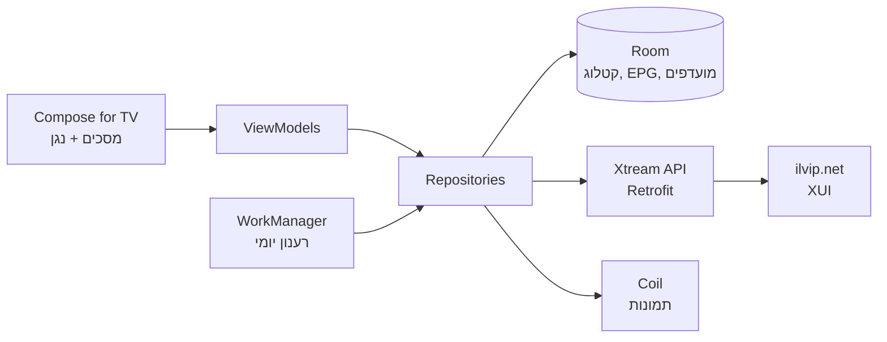

# אפיון — נגן IPTV פרימיום לאנדרואיד TV

2026-09-18 · @dor

## תקציר

בונים נגן IPTV לאנדרואיד TV בחוויית נטפליקס, שמתחבר לשרת Xtream/XUI קיים (ilvip.net) ומחליף את Televizo. השרת מספק את כל חומרי הגלם: 234 ערוצים ישראליים עם EPG בעברית וארכיון עד 32 ימים, סרטים וסדרות עם פוסטרים, backdrop, תקציר, שחקנים וז'אנר בעברית. הפער היחיד מול נטפליקס הוא ה־UI, ואותו אנחנו בונים.

מה הופך את זה לפרימיום מול Televizo:

- Navbar צדדי בסטייל נטפליקס, hero banner, שורות אופקיות עם פוסטרים 2:3 ודפדוף חלק ב־D-pad
- ערוץ אחד במקום 4 שורות: קיבוץ גיבויים לפי EPG עם failover אוטומטי כשהסטרים נופל
- "עכשיו בשידור" עם סרגל התקדמות, EPG grid ולחיצה על תוכנית מהעבר לצפייה מהארכיון
- נגן VOD עם scrubbing שמציג תמונות מהסרט תוך כדי גרירה (כמו נטפליקס), המשך צפייה, ופרק הבא אוטומטי
- פתיחה מיידית: כל הקטלוג בקאש מקומי (Room), מתרענן ברקע
- RTL אמיתי, טיפוגרפיה עברית, Dark theme עם צבע accent מהפוסטר

יעד ראשי: Android TV וסטרימרים (רימוט). טלפון בשלב מאוחר יותר על אותו קוד דאטה ונגן.

## ממצאי השרת (ilvip.net)

השרת הוא פאנל XUI.one 1.5.13, תואם Xtream Codes API במלואו, בלי DRM. נבדק ב־18.9.2026 עם החשבון הקיים.

| נושא | ממצא | השפעה על האפליקציה |
| --- | --- | --- |
| חשבון | פעיל עד 14.1.2027, 5 חיבורים במקביל, לא ניסיון | להציג תוקף וחיבורים בהגדרות; אפשר לפתח במקביל ל־Televizo |
| פרוטוקול | HTTPS על 443 מועדף (`server_protocol: https`), HTTP על 80 פתוח גם | לעבוד על `https://ilvip.net`, בלי cleartext לדומיין הראשי |
| פורמטי live | m3u8 ו־ts בלבד | HLS כדיפולט, TS כ־fallback |
| קטגוריות live | \~150, שטוחות (`parent_id: 0`), שמות דו־לשוניים לא עקביים | לנעוץ ישראל/מוזיקה/ספורט/רדיו, לקפל את שאר המדינות |
| ערוצים בישראל | 234, מתוכם \~60 גיבויים/מונגש/RUS שחולקים `epg_channel_id` ולוגו | קיבוץ לערוץ לוגי אחד + failover |
| Catch-up | כאן/קשת/רשת/עכשיו 32 ימים, HOT/yes 14, ספורט 12–14; רק בסטרים הראשי | EPG grid שגולל אחורה, ניגון מהארכיון |
| EPG | `get_short_epg` מחזיר כותרת ותיאור בעברית ב־Base64, דיוק לדקה | "עכשיו בשידור", מיני־EPG בנגן, גריד מלא מ־`xmltv.php` |
| EPG filler | ערוצים בלי לוח מקבלים placeholder (כותרת = שם הערוץ, בלוקים של 3 שעות) | heuristic לזיהוי ולהסתרה |
| לוגואים | PNG על השרת; בודדים מ־`fanc.tmsimg.com` (http) ו־gstatic | placeholder עם ראשי תיבות |
| VOD | `title`+`year`, plot/genre/cast בעברית, rating 0–10, mp4, מסודר לפי `added` | שורות ז'אנר, "חדש בשירות", דף פרטים מלא |
| VOD info | `backdrop_path` אמיתי (שונה מהפוסטר), `tmdb_id`, `duration_secs`, `country`; `youtube_trailer` ריק | backdrop בדף פרטים; כפתור טריילר רק כשיש |
| סדרות | `get_series` מסודר לפי `last_modified`; `null` ו־`""` מתערבבים; backdrop לרוב = cover | שורת "פרקים חדשים"; פרסר סלחני; cover מטושטש כרקע |
| פרקים | טלנובלות עם 600+ פרקים (פרחי דם: 645), `duration_secs`, `tmdb_id` לפרק, בלי plot/תמונה, `subtitles: []` | רשימה virtualized, המשך מפרק X, קפיצה למספר פרק |
| Bitrate | \~4.3 Mbps לפרקים (1080p) | badge HD לפי סף |
| Bot detection | השרת חוסם User-Agent לא מוכר | לשלוח UA קבוע ומזוהה בכל בקשה |

מה עדיין לא נבדק: `get_vod_categories` (מבנה קטגוריות הסרטים), גודל `xmltv.php`, תמיכת Range requests ב־mp4 ארוך, ומספר הסרטים הכולל.

## ארכיטקטורה וסטאק טכני

אפליקציה נייטיב ב־Kotlin עם Jetpack Compose for TV, נגן Media3/ExoPlayer, וקאש מלא של הקטלוג ב־Room. ארכיטקטורת MVVM + Repository, כך שהטלפון בעתיד מחליף רק את שכבת ה־UI.

| שכבה | טכנולוגיה | למה |
| --- | --- | --- |
| UI | Jetpack Compose for TV (`androidx.tv:tv-material`, `tv-foundation`) | קומפוננטות מוכנות ל־D-pad: Carousel, ImmersiveList, TabRow, focus management |
| נגן | Media3 ExoPlayer + MediaSession | HLS/TS/mp4, בחירת אודיו/כתוביות, ניגון ברקע לרדיו, PiP |
| רשת | Retrofit + OkHttp + kotlinx.serialization | Interceptor ל־User-Agent קבוע; serializer סלחני ל־null/`""`/מחרוזת־מספר |
| קאש | Room + DataStore | פתיחה ב־0 שניות, חיפוש מקומי, מועדפים והמשך צפייה |
| תמונות | Coil 3 | דיסק־קאש גדול לפוסטרים, placeholder, crossfade |
| רקע | WorkManager | רענון קטלוג ו־EPG יומי, יצירת thumbnails ל־scrubbing |
| DI | Hilt | סטנדרט, עובד טוב עם Compose |
| EPG | פרסר XMLTV סטרימינגי (XmlPullParser) | `xmltv.php` יכול להיות גדול, לא לטעון לזיכרון |

ה־UI קורא רק מ־Room. ה־Repository מרענן מהשרת ברקע וכותב ל־Room; המסך מתעדכן דרך Flow. תוצאה: אף מסך לא מחכה לרשת חוץ ממסך ה־login הראשון.

מינימום Android 7 (API 24) כדי לכסות סטרימרים ישנים; יעד API 34. Build variant נפרד ל־TV (Leanback launcher, banner) ולטלפון בעתיד.

## שכבת API ומודל דאטה

כל הקריאות הן `GET https://ilvip.net/player_api.php?username=U&password=P&action=…`. הנגן משתמש בכתובות הסטנדרטיות ולא ב־`direct_source` (טוקנים שמנוהלים בשרת ויכולים להתחלף).

| action | מה מחזיר | תדירות |
| --- | --- | --- |
| (ללא action) | `user_info` + `server_info` — אימות, תוקף, חיבורים | בכניסה + פעם ביום |
| `get_live_categories` | קטגוריות live | יומי |
| `get_live_streams` | כל הערוצים (בלי `category_id` = הכל) | יומי |
| `get_short_epg&stream_id=X&limit=N` | עכשיו/הבא לערוץ אחד | בפוקוס על ערוץ, קאש 10 דק׳ |
| `xmltv.php` | EPG מלא לכל הערוצים, XMLTV | יומי, ברקע |
| `get_vod_categories` / `get_vod_streams` | קטגוריות וסרטים | יומי |
| `get_vod_info&vod_id=X` | backdrop, tmdb\_id, duration, country | בפתיחת דף פרטים, קאש שבוע |
| `get_series` | כל הסדרות | יומי |
| `get_series_info&series_id=X` | עונות + כל הפרקים | בפתיחת סדרה, קאש 12 שעות |

**כתובות ניגון**

| סוג | כתובת |
| --- | --- |
| ערוץ חי | `https://ilvip.net/live/U/P/{stream_id}.m3u8` (fallback: `.ts`) |
| ארכיון | `https://ilvip.net/streaming/timeshift.php?username=U&password=P&stream={stream_id}&start=YYYY-MM-DD:HH-MM&duration={דקות}` |
| סרט | `https://ilvip.net/movie/U/P/{stream_id}.{container_extension}` |
| פרק | `https://ilvip.net/series/U/P/{episode_id}.{container_extension}` |

**כללי נרמול (בשכבת ה־Repository, פעם אחת, לפני Room)**

1. שמות: `trim`, כיווץ רווחים כפולים, הסרת תווי כיווניות (`\u200e`, `\u200f`), הסרת גרש/סימן קריאה תועים בתחילת שם. מפת overrides קטנה לשמות תצוגה (`STARS ספורט 5` → `ספורט 5 STARS`).
2. קטגוריות: פיצול `"English - עברית"` על `-`; תצוגה בעברית אם קיימת, אחרת אנגלית.
3. גיבויים: זיהוי לפי `epg_channel_id` זהה **וגם** לוגו זהה, או suffix `(גיבוי…)`/`מונגש`/`RUS`. הראשי = הרשומה עם `tv_archive: 1`, או הראשונה לפי `num`. הווריאנטים נשמרים כ־`sources` של הערוץ הלוגי עם תגית: `primary` / `backup` / `accessible` / `ru`.
4. `epg_channel_id` = `"150100"` או ריק → הערוץ מסומן `hasEpg = false`.
5. VOD/סדרות: `title` + `year` (לא `name`); `null` ו־`""` → `null`; `rating` מתקבל כמחרוזת או מספר → `Float?`, 0 → `null`; `genre` מפוצל בפסיקים לרשימה.
6. `backdrop_path[0] == cover` → `backdrop = null` (ה־UI ישתמש ב־cover מטושטש).
7. תמונות ב־`http://` מדומיין אחר (`ilvip11.net`, `fanc.tmsimg.com`) → ניסיון `https`, ואם נכשל — placeholder.
8. כותרת פרק `"שם - S01E05 - פרק 5"` → `episodeNumber = 5`, `displayTitle = "פרק 5"`.

**ישויות Room עיקריות**

| ישות | שדות מרכזיים |
| --- | --- |
| `Channel` | id לוגי, שם תצוגה, לוגו, קטגוריות (רשימה), `epgChannelId`, `hasEpg`, `archiveDays`, סדר |
| `ChannelSource` | `streamId`, `channelId`, סוג (primary/backup/accessible/ru), `tvArchive` |
| `EpgProgram` | `epgChannelId`, `start`, `end`, כותרת, תיאור, `isFiller` |
| `Movie` | `streamId`, כותרת, שנה, פוסטר, backdrop, plot, ז'אנרים, rating, משך, `added`, `tmdbId` |
| `Series` / `Season` / `Episode` | ids, כותרת, cover, `lastModified`; פרק: מספר, משך, `containerExtension` |
| `WatchProgress` | סוג (movie/episode/live), id, `positionMs`, `durationMs`, `updatedAt` |
| `Favorite`, `RecentChannel` | id + timestamp |

הכתובת, שם המשתמש והסיסמה נשמרים ב־`EncryptedSharedPreferences`, לא ב־Room.

## ניווט ומסכי Live TV

הניווט הראשי הוא navbar צדדי בסטייל נטפליקס־TV: אייקונים בלבד בזמן דפדוף בתוכן, נפתח עם שמות בלחיצת ימינה (RTL). בלי לוגו או טקסט קבוע בסיידבר — המיתוג מופיע רק במסך הפתיחה ובהגדרות. פריטים: חיפוש, בית, ערוצים חיים, לוח שידורים, סרטים, סדרות, הרשימה שלי, הגדרות. פוקוס נשאר בתוכן; ה־navbar לא "גונב" אותו.

**בית**

- Hero למעלה, קבוע בזמן הדפדוף (השורות גוללות מתחתיו, לא מעליו). ללא פוקוס הוא מתחלף כל 8 שניות בין 5 פריטים. כשעומדים על ערוץ — תצוגה מקדימה חיה של הערוץ בצד שמאל של ה־hero: ExoPlayer שני, מתחיל אחרי 700ms של פוקוס יציב, מושתק, קול אחרי 3 שניות; בצד ימין שם התוכנית, זמנים, תיאור וכפתור "צפה עכשיו". כשעומדים על סרט/סדרה — backdrop, כותרת, מטא ותקציר.
- שורה 1: **המשך צפייה** (סרטים, פרקים וערוץ אחרון) — מוצגת רק אם יש מה.
- שורה 2: **עכשיו בשידור** — כרטיסים 16:9 של ערוצי המועדפים (או ישראל אם אין מועדפים): לוגו, שם התוכנית הנוכחית, סרגל התקדמות דק.
- שורה 3: **חדש בשירות** (סרטים לפי `added`).
- שורה 4: **פרקים חדשים** (סדרות לפי `last_modified`).
- שורות ז'אנר לפי `genre`: דרמה, קומדיה, פשע, דוקומנטרי, ילדים.
- שורת **רדיו** קטנה בסוף.

**ערוצים חיים**

מסך שני־פאנלים: משמאל רשימת קטגוריות אנכית, מימין גריד/רשימה של ערוצים. הקטגוריות הנעוצות למעלה: מועדפים, ישראל, ספורט, מוזיקה, רדיו; מתחתיהן "עולם" שנפתח לרשימת המדינות. הסדר של השרת נשמר כדיפולט.

כרטיס ערוץ נקי: לוגו על רקע ניטרלי (עובד גם ללוגו לבן וגם לשחור), שם, מספר, מה משודר עכשיו, סרגל התקדמות. בלי תגיות — מידע על ארכיון ומקורות מופיע רק בלוח השידורים, בנגן ובתפריט ה־long-press (הוסף למועדפים / הסתר ערוץ / בחר מקור: ראשי, גיבוי, מונגש, רוסית).

כל ערוץ לוגי מוצג **פעם אחת**. הווריאנטים לא מופיעים ברשימה; הם זמינים מהנגן ומה־long-press. זה מקצר את רשימת ישראל מ־234 ל־\~170 פריטים.

לחיצה על ערוץ פותחת את הנגן במסך מלא. לחיצה חוזרת על אותו ערוץ מהרשימה בזמן ניגון סוגרת את הרשימה (לא מתחילה מחדש).

**מספר ערוץ ומעבר מהיר**

לכל ערוץ מספר רץ לפי הסדר בקטגוריה. הקלדת ספרות ברימוט בזמן צפייה מציגה overlay עם מספר + לוגו ומחליפה ערוץ אחרי שנייה. עורך ערוצים בהגדרות מאפשר סידור ידני ומספור קבוע.

**קטגוריות "עולם"**

\~140 מדינות בקיפול אחד, ממוינות אלפביתית בעברית, עם חיפוש בתוך הרשימה. המשתמש יכול לסמן מדינות כ"מוצגות" ואז הן קופצות לתפריט הראשי. הדיפולט: הכל מקופל.

## לוח שידורים (EPG) וארכיון

מסך "לוח שידורים" הוא גריד: ערוצים בציר האנכי, זמן בציר האופקי (RTL: הזמן זורם מימין לשמאל), קו "עכשיו" זוהר, ובלוק ממורכז לתוכנית שבפוקוס עם תיאור מלא. שתי הגישות לדאטה:

| מקור | שימוש | רענון |
| --- | --- | --- |
| `xmltv.php` (XMLTV מלא) | הגריד, חיפוש תוכניות, ארכיון | פעם ביום ב־WorkManager, פרסינג סטרימינגי ל־Room; שומרים 7 ימים קדימה ועד 32 אחורה |
| `get_short_epg` | עכשיו/הבא בכרטיסים ובנגן כשה־XMLTV עוד לא נטען | לפי דרישה, קאש 10 דקות |

כותרות ותיאורים מ־`get_short_epg` מגיעים ב־Base64 — לפענח ל־UTF-8 בפרסר.

**התנהגות הגריד**

- ניווט: ימין/שמאל בין תוכניות, למעלה/למטה בין ערוצים, OK מנגן (חי או ארכיון), long-press מציג פרטים.
- Page up/down (או צבעי הרימוט) קופצים ±3 שעות; לחיצה על "חזרה" חוזרת ל"עכשיו".
- מבזקים של 4 דקות (יש בכאן 11) מוצגים כפס דק בלי טקסט; הכותרת נראית בפוקוס.
- ערוצים עם `hasEpg = false` או filler מוצגים כבלוק אפור אחד לכל היום עם שם הערוץ בלבד — בלי סרגל התקדמות בכרטיסים.
- PiP: הערוץ הנוכחי ממשיך להתנגן בפינה בזמן דפדוף בגריד.

**זיהוי filler**

השרת מחזיר placeholder לערוצים בלי לוח (ערוץ ההודעות: בלוקים של 3 שעות, כותרת = שם הערוץ). תוכנית מסומנת `isFiller` כשמתקיים אחד:

1. הכותרת המנורמלת זהה לשם הערוץ המנורמל.
2. כל התוכניות באותו יום זהות בכותרת ובתיאור.
3. משך ≥ 3 שעות והכותרת חוזרת לפחות 4 פעמים ביום.

**ארכיון (catch-up)**

- תוכנית שהסתיימה בערוץ עם `archiveDays > 0` ובתוך החלון מקבלת אייקון "נגן מהארכיון". OK מנגן דרך `timeshift.php` עם `start` ו־`duration` של התוכנית.
- הארכיון קיים רק במקור הראשי של הערוץ; failover לגיבוי לא חל על ארכיון.
- מהנגן: לחיצה על "חזרה להתחלה" (start-over) בתוכנית שרצה עכשיו, ו"התוכנית הקודמת" בגלילה שמאלה בסרגל.
- מסך "מה פספסתי": שורה בבית עם התוכניות מהיממה האחרונה בערוצי המועדפים, לפי סדר הזמן.

**ערוץ ההודעות**

התיאור של ערוץ 85956 הוא ערוץ התקשורת של הספק. פעם ביום קוראים את ה־description שלו; אם השתנה — banner דיסקרטי במסך הבית עם הטקסט, ניתן לסגירה.

## סרטים (VOD)

מסך הסרטים בנוי כמו נטפליקס: hero למעלה, ומתחתיו שורות אופקיות של פוסטרים 2:3. הדפדוף חלק כי כל הדאטה מקומי — אין spinner בין שורות.

**Hero**

הפריט שבפוקוס בשורה הראשונה משתלט על ה־hero: backdrop (מ־`get_vod_info`, נטען ברקע לכל סרט שבפוקוס), כותרת גדולה, שורת מטא (2026 · פשע, דרמה · 1:55 · ★ 7.3 · קנדה), תקציר עד 3 שורות. ההחלפה עם crossfade של 300ms ודיליי של 400ms כדי לא להבהב בגלילה מהירה. אם אין backdrop — cover מוגדל ומטושטש עם גרדיאנט כהה.

**שורות**

| שורה | מקור | סדר |
| --- | --- | --- |
| המשך צפייה | `WatchProgress` בין 2% ל־95% | לפי עדכון אחרון |
| חדש בשירות | `added` | חדש → ישן |
| מדורגים גבוה | `rating ≥ 7`, `year ≥ נוכחי−3` | rating |
| קטגוריות השרת | `get_vod_categories` | סדר השרת |
| לפי ז'אנר | `genre` מפוצל: דרמה, קומדיה, מותחן, אימה, דוקומנטרי, ילדים, ישראלי | rating ואז added |
| קצר לערב | `episode_run_time ≤ 95` | added |

כרטיס פוסטר: תמונה 2:3 עם פינות מעוגלות 8dp, בפוקוס — scale 1.08 + glow לבן דק + שם הסרט ושנה מופיעים מתחת. בלי טקסט על הפוסטר כשלא בפוקוס. סרט עם `WatchProgress` מקבל סרגל אדום דק בתחתית.

**דף פרטים**

מסך מלא: backdrop ברקע עם גרדיאנט מימין (RTL) ומלמטה; בצד ימין כותרת, מטא, תקציר מלא עם "קרא עוד", שחקנים, בימוי, מדינה. כפתורים: **נגן** / **המשך מ־1:12:30** (ראשי), **הרשימה שלי**, **טריילר** (רק אם `youtube_trailer` לא ריק — פותח ב־YouTube אם מותקן, אחרת WebView), **מהתחלה** (אם יש progress).

מתחת: שורת "דומים" — סרטים באותו ז'אנר ראשי, ממוינים לפי rating, בלי הסרט הנוכחי.

**חיפוש בסרטים**

החיפוש הגלובלי (סעיף נפרד) מחפש גם בשמות שחקנים ובבימוי, כי `cast` מלא. לחיצה על שם שחקן בדף פרטים פותחת תוצאות עם כל הסרטים שלו בשירות.

**ביצועים**

- Coil עם `memoryCachePolicy` + דיסק־קאש 512MB; פוסטרים נטענים בגודל התצוגה (\~300×450), backdrop ב־1280 רוחב.
- `LazyRow` עם `key = streamId`, prefetch של 2 פריטים מחוץ למסך.
- backdrop של `get_vod_info` נשמר ב־Room אחרי הטעינה הראשונה, כך שה־hero מיידי בפעם השנייה.

## סדרות

מסך הסדרות זהה במבנה למסך הסרטים (hero + שורות), עם שורה ראשונה "פרקים חדשים" לפי `last_modified`. ההבדל הגדול הוא דף הסדרה, שחייב לעבוד טוב גם על טלנובלה עם 645 פרקים.

**דף סדרה**

חלק עליון כמו דף סרט: backdrop (או cover מטושטש כשהם זהים), כותרת, מטא (2022 · דרמה · 3 עונות · 645 פרקים · ★ 8), תקציר. כפתור ראשי אחד:

| מצב | כפתור |
| --- | --- |
| לא נצפה | **התחל · עונה 1 פרק 1** |
| באמצע פרק | **המשך · עונה 2 פרק 187 · נותרו 12 דק׳** |
| פרק הסתיים | **הפרק הבא · עונה 2 פרק 188** |
| הסדרה הסתיימה | **צפה שוב** |

כפתורים משניים: הרשימה שלי, סמן כנצפה עד כאן.

**עונות ופרקים**

- טאבים אופקיים לעונות עם cover של העונה ומספר הפרקים. הטאב שנפתח = העונה שבה המשתמש נמצא.
- רשימת פרקים אנכית, `LazyColumn` עם `key = episodeId`, כרטיס 16:9 לכל פרק. אין תמונת פרק מהשרת — משתמשים ב־cover של העונה עם מספר הפרק גדול עליו, ובעתיד ב־thumbnail שנוצר בנגן.
- כרטיס פרק: "פרק 187", משך (`duration_secs`), סרגל התקדמות, ✓ אם נצפה. בלי הכותרת המלאה "פרחי דם - S02E187 - פרק 187".
- הרשימה נפתחת **ממורכזת על הפרק הנוכחי**, לא מהראש.
- **קפיצה לפרק**: הקלדת ספרות ברימוט בתוך הרשימה פותחת overlay "פרק \_\_\_" וקופצת אליו. זה הפיצ'ר החשוב ביותר לטלנובלות.
- Page up/down קופצים 20 פרקים.

**סמן כנצפה**

long-press על פרק: "סמן כנצפה", "סמן כלא נצפה", "סמן עד כאן כנצפה" (מסמן את כל הפרקים שלפניו). מי שמתחיל טלנובלה באמצע צריך את זה.

**דאטה**

- `get_series_info` מוחזר בבקשה אחת עם כל הפרקים; נשמר ב־Room, מרוענן ב־12 שעות או כשה־`last_modified` ברשימה השתנה.
- `episodes` הוא מפה שמפתחה מספר העונה כמחרוזת; לא להסתמך על סדר המפתחות.
- פרק חדש בסדרה שברשימה שלי → נקודה כחולה על הכרטיס בבית + התראת מערכת אופציונלית (Android TV channel notification).

**פרק הבא אוטומטי**

15 שניות לפני סוף פרק מופיע כרטיס "הפרק הבא" עם ספירה לאחור; OK מנגן מיד, חזרה מבטל. אחרי 3 פרקים רצופים בלי אינטראקציה — "עדיין צופה?" בסטייל נטפליקס.

## הנגן

נגן אחד (Media3 ExoPlayer) עם שני מצבי UI: **Live** ו־**VOD**. בשניהם ה־overlay שקוף, נעלם אחרי 4 שניות, וכל פעולה ברימוט חוזרת אליו. שכבת הווידאו לא מתחלפת בין מצבים — רק ה־controls.

**מצב Live**

- למעלה/למטה: זפזופ בתוך הקטגוריה הנוכחית. הערוץ מתחלף מיד עם overlay של לוגו, שם, מספר ותוכנית נוכחית.
- OK: מיני־EPG מלמטה — הערוץ הנוכחי ושני הבאים, עם עכשיו/הבא לכל אחד; ימין/שמאל גולל בין ערוצים בלי להחליף, OK מחליף.
- למטה ארוך: רשימת הערוצים המלאה בצד, עם PiP של הערוץ הנוכחי.
- שמאל/ימין: בערוץ עם ארכיון — סרגל זמן של התוכנית הנוכחית; "חזרה להתחלה" ו"התוכנית הקודמת".
- תפריט (⋮): מקור (ראשי/גיבוי/מונגש/רוסית), אודיו, כתוביות, יחס תמונה, מידע טכני (bitrate, רזולוציה, buffer).
- Zapping מהיר: `LoadControl` עם buffer התחלתי 1.5 שניות ל־live; pre-connect לערוץ הבא והקודם ברשימה (הורדת ה־playlist בלבד, לא segments).

**Failover אוטומטי**

שגיאת רשת/HTTP או stall מעל 8 שניות במקור הראשי → מעבר שקט למקור הבא באותו ערוץ לוגי (גיבוי 1 → 2 → 3). Toast קטן "עברנו לגיבוי". חזרה לראשי בניסיון הבא של המשתמש, לא באמצע צפייה. אם כל המקורות נפלו — מסך "הערוץ לא זמין כרגע" עם כפתור "ערוץ הבא".

**מצב VOD (סרטים ופרקים)**

- שמאל/ימין: seek ±10 שניות בלחיצה, האצה בלחיצה ארוכה (×2, ×4, ×8).
- **Scrubbing עם תמונות** (כמו נטפליקס): בזמן גרירה בסרגל מופיעה מעליו תמונה מהסרט בנקודת היעד, עם עוד 2 תמונות מכל צד בקטן. הסרגל עצמו הוא רצועת תמונות — פירוט למטה.
- OK: play/pause עם אנימציה.
- למטה: פאנל אודיו/כתוביות/מהירות (0.75–1.5) ו"פרק הבא" בסדרות.
- למעלה: בסדרות — רשימת הפרקים של העונה ב־PiP, לקפיצה בין פרקים.
- המשך צפייה: הפוזיציה נשמרת כל 10 שניות וביציאה. פחות מ־2% או מעל 95% = לא נשמר / מסומן כנצפה.

**איך מייצרים את תמונות ה־scrubbing**

השרת לא מספק sprite sheets, אז מייצרים אותן על המכשיר:

1. בהתחלת ניגון של סרט/פרק, WorkManager מפעיל job ברקע שפותח את אותו mp4 ב־`MediaMetadataRetriever` (או ExoPlayer שני ללא רינדור) ומחלץ frame כל 10 שניות ב־320×180.
2. ה־frames נשמרים כ־sprite sheet אחד (10×10 לכל 1,000 שניות) בדיסק־קאש, ממופתחים לפי `streamId`. סרט של שעתיים ≈ 720 תמונות ≈ 3–5MB.
3. ה־UI מציג את מה שכבר קיים: בדקות הראשונות רק חלק מהסרגל מכוסה, והשאר מתמלא בזמן הצפייה. נטפליקס עושה את זה מהשרת; אצלנו זה progressive.
4. ה־job רץ רק על WiFi/Ethernet ומוגבל ל־2 סרטים במקביל; הקאש מנוקה ב־LRU עד 1GB.
5. אם למכשיר אין כוח (סטרימר זול) — fallback ל־seek preview רגיל של ExoPlayer (I-frame הקרוב), בלי רצועה.

התמונות האלה משמשות גם כ־thumbnail לפרקים בדף הסדרה ולכרטיס "המשך צפייה" בבית.

**רדיו**

ערוצי רדיו (קטגוריה 20 או סטרים ללא video track) מקבלים מסך ייעודי: לוגו גדול, שם התחנה, ויזואליזציה עדינה; ניגון ממשיך ברקע עם MediaSession כשיוצאים מהנגן.

**טכני**

- User-Agent קבוע ומזוהה (`IsraelTV/1.0 (Android TV)`) על כל בקשות הווידאו והתמונות.
- Buffer ל־VOD: 30 שניות קדימה, 15 אחורה.
- `.m3u8` כדיפולט ל־live; אם ה־manifest נכשל פעמיים — `.ts` לאותו stream.
- כתוביות מוטמעות (אם קיימות ב־mp4) נחשפות דרך `TrackSelector`; אין כתוביות חיצוניות מהשרת.
- Audio passthrough ל־AC3/EAC3 כשהטלוויזיה תומכת.
- 4K (ספורט 5 4K): בדיקת `MediaCodecInfo` לפני ניגון; אם המכשיר לא תומך, מציעים את הגרסה הרגילה.

## חיפוש, הרשימה שלי, המשך צפייה, בקרת הורים

**חיפוש**

חיפוש אחד גלובלי, מקומי לחלוטין (Room FTS), תוצאות תוך כדי הקלדה. מקלדת T9 על המסך בעברית/אנגלית עם מעבר שפה בכפתור צבעוני; תמיכה בחיפוש קולי דרך Android TV Assistant אם המכשיר תומך.

| מחפש ב־ | שדות | תצוגה |
| --- | --- | --- |
| ערוצים | שם תצוגה, שם מקורי, מספר ערוץ | שורה ראשונה, כרטיסים 16:9 |
| תוכניות EPG | כותרת, תיאור (היום + 7 ימים + ארכיון) | "משודר ב־… / זמין בארכיון" |
| סרטים | כותרת, שחקנים, בימוי, ז'אנר | פוסטרים |
| סדרות | כותרת, שחקנים, ז'אנר | פוסטרים |

חיפוש בעברית תואם גם ללא ניקוד ועם/בלי גרשיים ("ג'ו" = "גו"). הקלדת מספר בלבד קופצת לערוץ.

**הרשימה שלי**

רשימה אחת לערוצים, סרטים וסדרות, בסדר הוספה. ערוצים מועדפים מקבלים גם: קטגוריה "מועדפים" בראש רשימת הערוצים, שורת "עכשיו בשידור" בבית, ו"מה פספסתי" מהארכיון. long-press על כל פריט → הוסף/הסר.

**המשך צפייה**

- שורה ראשונה בבית ובמסכי סרטים/סדרות. כרטיס 16:9 עם thumbnail מהנקודה שבה עצרו (מהסcrubbing cache) או backdrop, סרגל אדום, "נותרו 38 דק׳".
- ערוץ אחרון: כרטיס אחד בתחילת השורה, "חזור לכאן 11".
- הסרה מהשורה ב־long-press; פרק שהסתיים מוחלף אוטומטית בפרק הבא.
- "עדיין צופה?" אחרי 3 פרקים רצופים ללא אינטראקציה, ובערוץ חי אחרי 4 שעות ללא לחיצה (חוסך רוחב פס וחיבור מהמכסה של 5).

**בקרת הורים**

- PIN בן 4 ספרות (נשמר מוצפן). מנעול על קטגוריות שלמות (למשל yes+ DARK, ערוץ האהבה) או פריטים בודדים.
- פריט נעול מוצג מטושטש עם אייקון מנעול; OK מבקש PIN, שמשוחרר ל־30 דקות.
- "פרופיל ילדים" אופציונלי: מסך בית שמציג רק קטגוריות ילדים ותוכן עם ז'אנר "ילדים"/"משפחה". מעבר פרופיל דורש PIN.
- הסתרת ערוצים/קטגוריות (בלי PIN) נפרדת מנעילה — למי שרק רוצה רשימה נקייה.

**היסטוריה ופרטיות**

כל הדאטה האישי (רשימה, progress, היסטוריה) מקומי על המכשיר. ייצוא/ייבוא כ־JSON להעברה בין מכשירים; סנכרון ענן לא בסקופ.

## עיצוב ו־TV UX

השפה הוויזואלית: כהה, שקטה, התמונות עושות את העבודה. הטקסט מינימלי ומופיע בפוקוס. כל אינטראקציה ברימוט מקבלת תגובה ויזואלית תוך 100ms.

**Focus ו־D-pad**

- כרטיס בפוקוס: `scale 1.08`, מסגרת לבנה 2dp עם glow רך, אנימציה 150ms `FastOutSlowIn`. שאר הכרטיסים בשורה דוהים ל־85% אטימות.
- הפוקוס נשמר לכל שורה בנפרד (`rememberLazyListState` + focus restorer): גלילה למטה ובחזרה למעלה חוזרת לאותו פוסטר.
- חזרה (Back) תמיד עולה רמה אחת: כרטיס → ראש השורה → navbar → יציאה (עם אישור). לעולם לא סוגרת את האפליקציה בהפתעה.
- כפתורי צבע ברימוט: אדום = מועדפים, ירוק = מקור/גיבוי, צהוב = כתוביות, כחול = מיני־EPG. מוצגים כ־hint בתחתית הנגן.
- לחיצה ארוכה = תפריט הקשר בכל מקום שיש כרטיס.

**RTL**

- `LayoutDirection.Rtl` ברמת ה־Theme; שורות אופקיות נפתחות מימין, הראשון בפוקוס בצד ימין; ה־navbar בצד ימין.
- מספרים, זמנים ושמות אנגליים (HOT, yes, Eurosport) נעטפים ב־`\u2068…\u2069` (isolate) כדי שלא יתהפכו בתוך משפט עברי.
- אייקוני חץ (הבא/הקודם) מתהפכים אוטומטית (`autoMirrored`).
- מסך EPG: הזמן זורם מימין לשמאל, קו ה"עכשיו" בצד ימין של המסך.

**טיפוגרפיה**

| שימוש | פונט | גודל (TV, 1080p) |
| --- | --- | --- |
| כותרות hero | Heebo Bold | 48sp |
| כותרות שורות ומסכים | Heebo SemiBold | 28sp |
| שם פריט, מטא | Heebo Medium | 22sp |
| תקציר, EPG | Heebo Regular | 20sp |
| מספרי ערוצים, זמנים | Heebo Medium, `tnum` | 22sp |

מינימום 20sp לכל טקסט שנקרא ממרחק 3 מטר. שורות טקסט לא יותר מ־60 תווים.

**צבע**

- רקע `#0E0E10`, משטחים `#1A1A1E` / `#232329`, טקסט ראשי `#F2F2F2`, משני `#A0A0A8`.
- Accent דינמי: Palette מהפוסטר/backdrop של הפריט בפוקוס צובע את הגרדיאנט של ה־hero ואת סרגל ההתקדמות (`androidx.palette`). ברירת מחדל: `#E50914`-ish אדום עמוק, או צבע מותג שתבחר.
- סרגל התקדמות: אדום ל־VOD, לבן ל־live.

**תמונות**

- פוסטרים 2:3 (200×300dp), כרטיסי ערוץ/פרק 16:9 (320×180dp), hero backdrop מלא עם גרדיאנט 40% מלמטה ו־60% מצד ימין.
- Placeholder: מלבן בצבע משטח עם ראשי תיבות של השם (2 אותיות) בפונט גדול; הופך לתמונה ב־crossfade.
- לוגו ערוץ תמיד על משטח `#1F1F1F` בריבוע עם padding 12dp — עובד ללוגו לבן ולשחור.
- אין טקסט על תמונות חוץ מ־hero.

**תנועה**

- כניסת מסך: fade + slide 16dp, 200ms. מעבר hero: crossfade 300ms.
- אין אנימציות ארוכות מ־300ms חוץ מה־countdown של "פרק הבא".
- Skeleton loaders רק במסך הראשון אחרי login; אחרי זה הכל מ־Room.

**נגישות**

- ניגודיות מינימום 4.5:1 לכל טקסט.
- TalkBack: תיאור לכל כרטיס ("כאן 11, עכשיו: בחצי היום, נותרו 20 דקות").
- ערוצי "מונגש" מסומנים בתפריט המקורות כ"תיאור קולי".

## הגדרות, חשבון וסנכרון ברקע

**כניסה (פעם אחת)**

מסך פתיחה עם שלושה שדות — שרת, שם משתמש, סיסמה — כמו ב־Televizo, פלוס סריקת QR מהטלפון כדי לא להקליד ברימוט. אחרי אימות מוצלח: "טוענים את הערוצים…" עם progress אמיתי (קטגוריות → ערוצים → סרטים → סדרות → EPG), ומעבר לבית ברגע שהערוצים נטענו; השאר ממשיך ברקע. תמיכה בכמה חשבונות/פלייליסטים בעתיד — המודל כבר מוכן לזה (`accountId` על כל ישות).

**מסך הגדרות**

| קטגוריה | פריטים |
| --- | --- |
| חשבון | סטטוס, תוקף (14.1.2027), חיבורים פעילים/מקסימום (1/5), התנתקות |
| ערוצים | עורך ערוצים (סדר, מספור, הסתרה), קטגוריות מוצגות, מקור דיפולט (ראשי/מונגש/רוסית) |
| נגן | פורמט live (HLS/TS/אוטומטי), buffer (קטן/רגיל/גדול), failover אוטומטי, יחס תמונה, passthrough, פרק הבא אוטומטי, "עדיין צופה?" |
| לוח שידורים | היסט זמן EPG (±שעות), הצגת filler, ימי ארכיון להצגה |
| תצוגה | שפה (עברית/אנגלית/רוסית), גודל טקסט, אנימציות, thumbnails ל־scrubbing (פעיל/כבוי/רק WiFi) |
| בקרת הורים | PIN, פריטים נעולים, פרופיל ילדים |
| דאטה | רענון עכשיו, גודל קאש תמונות, ניקוי, ייצוא/ייבוא הגדרות ורשימה |
| אודות | גרסה, מידע טכני על השרת (XUI 1.5.13), יומן שגיאות, שליחת דיאגנוסטיקה |

**סנכרון ברקע (WorkManager)**

| משימה | תדירות | תנאים |
| --- | --- | --- |
| אימות + `user_info` | בפתיחה, ופעם ב־24 שעות | תמיד |
| קטלוג live (קטגוריות + ערוצים) | פעם ב־24 שעות, ובלחיצה על "רענן" | רשת |
| קטלוג VOD + סדרות | פעם ב־24 שעות | רשת, לא בזמן ניגון |
| EPG (`xmltv.php`) | פעם ב־12 שעות, בלילה עדיפות | WiFi/Ethernet |
| `get_series_info` לסדרות ברשימה שלי | פעם ב־6 שעות | רשת — כדי לזהות פרקים חדשים |
| Thumbnails ל־scrubbing | בזמן ניגון | WiFi/Ethernet, סוללה לא רלוונטית ב־TV |
| ניקוי קאש | שבועי | — |

רענון הוא diff, לא החלפה: ערוצים שנעלמו מהשרת מסומנים `isActive = false` ונעלמים מהתצוגה, אבל המועדפים וה־progress שלהם נשארים למקרה שיחזרו.

**התראות (Android TV)**

- Home screen channel (Leanback recommendations): "המשך צפייה" ו"פרקים חדשים" מופיעים במסך הבית של הטלוויזיה בלי לפתוח את האפליקציה.
- התראת "החשבון מסתיים בעוד 7 ימים" מתוך `exp_date`.
- banner מערוץ ההודעות של הספק כשהתוכן שלו משתנה.

## Edge cases ופוליש

רוב ההבדל בין "עובד" ל"מרגיש פרימיום" נמצא כאן. כל שורה נצפתה בדאטה האמיתי של השרת.

| מקרה | דוגמה מהשרת | טיפול |
| --- | --- | --- |
| שם עם רווח כפול / תווים תועים | `Eurosport  2`, `'ויוה וינטג`, `!הופ` | נרמול + מפת overrides; בדיקת יחידה על כל 234 השמות |
| בלגן RTL/LTR בשם | `4K ספורט 5`, `STARS ספורט 5`, `il ערוץ המוזיקה` | override לשם תצוגה; חלקים לטיניים ב־isolate |
| ערוץ בכמה קטגוריות | NBA TV ב־`[1, 30]` | `category_ids` הוא המקור; מוצג בשתיהן, מועדף פעם אחת |
| גיבוי בלי ארכיון | כל הגיבויים `tv_archive: 0` | ארכיון תמיד מהמקור הראשי |
| EPG placeholder | ערוץ ההודעות, בלוקים של 3 שעות | `isFiller` → בלי סרגל, בלוק אפור |
| `epg_channel_id` משותף לחו"ל | `150100` ל־ABC/FOX/CBS/WWE/UFC/NBA | `hasEpg = false` |
| `epg_channel_id` בפורמט XMLTV | `BBCNews.uk` | הפרסר מקבל מחרוזת חופשית, לא רק מספר |
| לוגו מדומיין חיצוני / http | `fanc.tmsimg.com`, `gstatic`, `ilvip11.net:80` | ניסיון https → placeholder ראשי תיבות |
| `null` מול `""` | `cast: null` בדולסה אמור, `cast: ""` בפרחי דם | serializer: שניהם → `null` |
| `rating` כמחרוזת/מספר/0 | `"8"`, `7.3`, `0` | `Float?`; 0 → לא מוצג |
| `year: null` | דולסה אמור | מטא בלי שנה, בלי "null" על המסך |
| backdrop = cover | דולסה אמור, גראנד הוטל | cover מטושטש כרקע |
| תקציר ארוך מאוד עם `\n` ו־`\u00a0` | חיים של קוקו | נרמול רווחים, 3 שורות + "קרא עוד" |
| כותרת פרק רדונדנטית | `פרחי דם - S01E01 - פרק 1` | פרסינג ל־"פרק 1" |
| 600+ פרקים בעונה | פרחי דם, 291 בעונה 3 | LazyColumn, פתיחה על הפרק הנוכחי, קפיצה במספר |
| `youtube_trailer` ריק | כל הדוגמאות | כפתור טריילר מוצג רק כשיש ערך |
| `episode_run_time: 0` | סטנד־אפ של ג'ו קוי | משך מ־`get_vod_info.duration_secs`, אחרת לא מוצג |
| `direct_source` עם טוקן | כל הפריטים | לא בשימוש; כתובות סטנדרטיות בלבד |
| Bot detection | חסימת UA לא מוכר | UA קבוע בכל Interceptor, כולל Coil ו־ExoPlayer |
| כותרת EPG ב־Base64 | `get_short_epg` | פענוח UTF-8, fallback לטקסט גולמי אם הפענוח נכשל |
| מכסת חיבורים | `max_connections: 5` | בשגיאת 403/`auth: 0` בזמן ניגון — הודעה "כל החיבורים תפוסים" עם מספר החיבורים |
| חשבון פג תוקף | `exp_date` | מסך ייעודי עם התאריך; לא crash, לא "שגיאת רשת" |

**מצבי שגיאה**

- אין רשת: האפליקציה נפתחת מהקאש, כרטיסים פעילים, ניסיון ניגון מציג "אין חיבור לאינטרנט" ולא spinner אינסופי.
- השרת לא זמין: banner בראש הבית "השרת לא מגיב, מציגים מידע מ־HH:MM"; ניסיון חוזר כל 30 שניות.
- סטרים נופל באמצע: failover → אם אין גיבוי, 3 ניסיונות חיבור עם backoff → מסך שגיאה עם "ערוץ הבא".
- תמונה נכשלת: placeholder, בלי לוג רועש, ניסיון חוזר ברענון הבא.

**איכות**

- בדיקות יחידה על הפרסר עם ה־JSON האמיתי מהשרת (שמורים כ־fixtures): קטגוריות, 234 ערוצים, VOD, series\_info של פרחי דם, EPG של כאן 11 וערוץ ההודעות.
- בדיקת נרמול שמות: אף שם תצוגה לא מתחיל או מסתיים בתו לא־אלפאנומרי.
- Compose UI tests לניווט D-pad במסך הבית ובנגן.
- מדד ביצועים: זמן מפתיחת האפליקציה לבית < 1.5 שניות (מהקאש), זפזופ < 1 שנייה, גלילה ב־60fps על Chromecast with Google TV.

## תוכנית פיתוח

שלושה שלבים, כל אחד מסתיים ב־APK שאפשר להתקין על הסטרימר ולצפות איתו. הסדר בנוי כך ש־Televizo מוחלף כבר בסוף MVP.

| שלב | מה נכנס | קריטריון סיום |
| --- | --- | --- |
| **MVP** | כניסה + אימות; שכבת API ונרמול עם fixtures; Room + רענון יומי; navbar + בית בסיסי; רשימת ערוצים עם קטגוריות נעוצות וקיבוץ גיבויים; נגן live עם זפזופ, מיני־EPG (`get_short_epg`), failover; מועדפים; מספרי ערוצים | צופים בכאן 11 וספורט 5 יום שלם בלי לחזור ל־Televizo |
| **V1** | XMLTV מלא + EPG grid + ארכיון; סרטים (hero, שורות, דף פרטים, `get_vod_info`); סדרות עם דף סדרה, עונות, קפיצה לפרק, המשך צפייה, פרק הבא; חיפוש גלובלי; scrubbing עם תמונות; רדיו עם רקע; בקרת הורים; הגדרות מלאות | חוויית נטפליקס מלאה בערוצים ובספרייה |
| **V2** | Leanback home channels; QR login; פרופיל ילדים; ייצוא/ייבוא; ריבוי חשבונות; TMDB להשלמת תמונות פרקים; גרסת טלפון/טאבלט על אותו core | פוליש, פלטפורמות נוספות |

**סדר עבודה ב־MVP (שבועות משוערים לעבודה עם Claude Code)**

1. פרויקט, Hilt, Retrofit, מודלים + serializer סלחני, fixtures מה־JSON האמיתי, בדיקות פרסר ונרמול — שבוע 1.
2. Room, Repository, WorkManager, מסך כניסה + טעינה ראשונית — שבוע 1–2.
3. Compose for TV: theme (RTL, Heebo, צבעים), navbar, בית, רשימת ערוצים, focus — שבוע 2–3.
4. נגן live: ExoPlayer, זפזופ, overlay, מיני־EPG, failover, UA — שבוע 3–4.
5. מועדפים, מספרי ערוצים, הגדרות בסיסיות, APK ראשון על הסטרימר — שבוע 4.

**החלטות פתוחות**

- [ ] שם ואייקון לאפליקציה (ה־UA בקוד תלוי בזה) - NakashTV
- [ ] צבע accent קבוע או דינמי מהפוסטר בלבד
- [ ] אם scrubbing thumbnails נכנס ל־MVP או נשאר ל־V1
- [ ] בדיקת `get_vod_categories`, גודל `xmltv.php` ו־Range requests לפני תחילת V1

**איך ממשיכים מכאן**

**מה כבר קיים (18.9.2026)**

- פרוטוטייפ אינטראקטיבי של ה־UX עם הדאטה האמיתי, ניווט חצים/שלט/עכבר: https://claude.ai/artifact/8iFMU42Vt6Ko95w36NgYVu
- פרויקט אנדרואיד `NakashTV-android.zip`: Gradle (Compose for TV, Media3, Room, Hilt), שכבת API עם serializers סלחניים, נרמול וקיבוץ גיבויים, Room + Repositories + WorkManager, `PlayerController` עם failover ו־`PreviewPlayer`, מסך בית מלא, נגן מלא, login, ובדיקות יחידה על fixtures מהשרת. שאר המסכים הם stubs עם TODO מדויק.
- `CLAUDE.md` בריפו: כללי הברזל + 10 tasks לפי סדר לסשן בנייה ב־Claude Code (מודל זול מספיק ל־2–9; לחזור למודל החזק ל־review ולבאגים עקשניים).

לפני מסירה לבנייה: לייצא את המסמך הזה כ־Markdown ל־`docs/spec.md` (Export → Markdown), ולהוסיף גופני Heebo ל־`res/font`.
